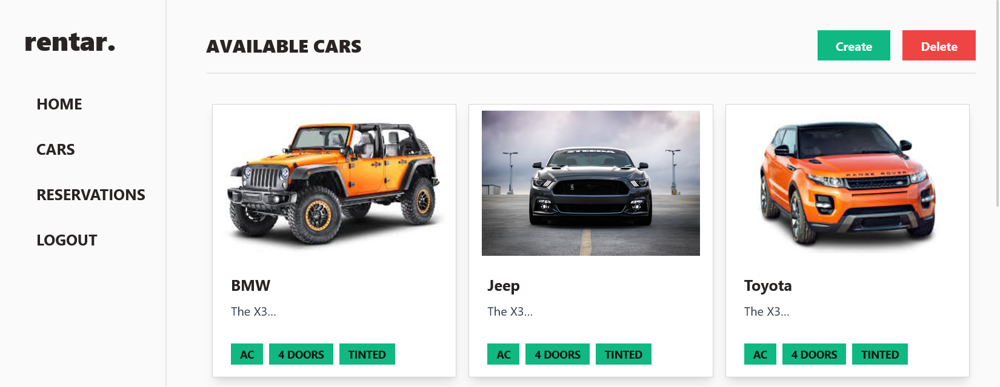
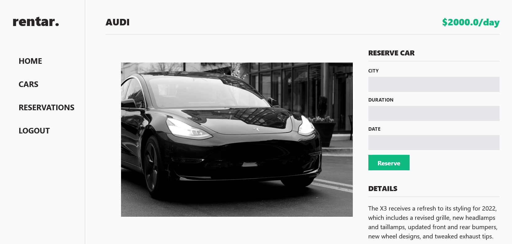

# Car-rental-app Frontend
  This project (the frontend part) is using the [Car-rental-app-back-end](https://github.com/TimmyChan99/Car-rental-app-back-end) repo as a backend API.
  This webapp is allows users to get list of cars, cars details, reserve a car and check their reservations list. If the user is the admin that give them the authorization to delete from or add a new car to the list of car. 
  Users need to sign up or sign in to access the API endponits. They can sign up or sign in using the API endpoints.
  
## Preview

  

  

## Built With

- JavaScript
- React 18
- Redux Toolkit
- Jest
- Rest

## Getting Started

### **Setup**
TTo get a local copy up and running follow these simple example steps:

- Run `git clone https://github.com/Mwapsam/Car-rental-app.git`
- Go to the folder `cd Car-rental-app`
- Run `npm install` to install dependencies
- Run `npm start` to start the server
- Run `npm test` to run  all spec files 

## Authors

👤 **Fatima Ezzahra**

- GitHub: [@TimmyChan99](https://github.com/TimmyChan99)
- Twitter: [@elemenoun](https://twitter.com/elemenoun)
- LinkedIn: [LinkedIn](https://www.linkedin.com/in/fatima-ezzahra-elemenoun-020841225/)

👤 **Mwape Samuel**

- GitHub: [@mwapsam](https://github.com/Mwapsam)
- Twitter: [@mwapesamuel4](https://twitter.com/mwapesamuel4)
- LinkedIn: [mwapsam](https://www.linkedin.com/in/mwapsam/)

👤 **Yaseer Okino**

- GitHub: [yaseerokino](https://github.com/yaseerokino)
- LinkedIn: [Yaseer Okino](https://linkedin.com/in/yaseerokino)

👤 **Fikerte Tesfaye** 

- GitHub: [@Fikerte-T](https://github.com/Fikerte-T)
- Twitter: [@tofikertesfaye](https://twitter.com/tofikertesfaye)
- LinkedIn: [LinkedIn](https://www.linkedin.com/in/fikerte-tesfaye-a68337216/)

👤 **Lilian Francis**

- Github : [@lilyfrancis](https://github.com/lilyfrancis)
- Twitter: [@ifnotlily](https://twitter.com/ifnotlily)
- LinkdIn : [@lilianfrancis](https://www.linkedin.com/in/lilianfrancis/)
- 

## 🤝 Contributing

Contributions, issues, and feature requests are welcome!

Feel free to check the [issues page](../../issues/).

## Show your support

Give a ⭐️ if you like this project!

## Acknowledgments

- Hat tip to anyone whose code was used
- Inspiration
- etc

## 📝 License

This project is [MIT](./MIT.md) licensed.
